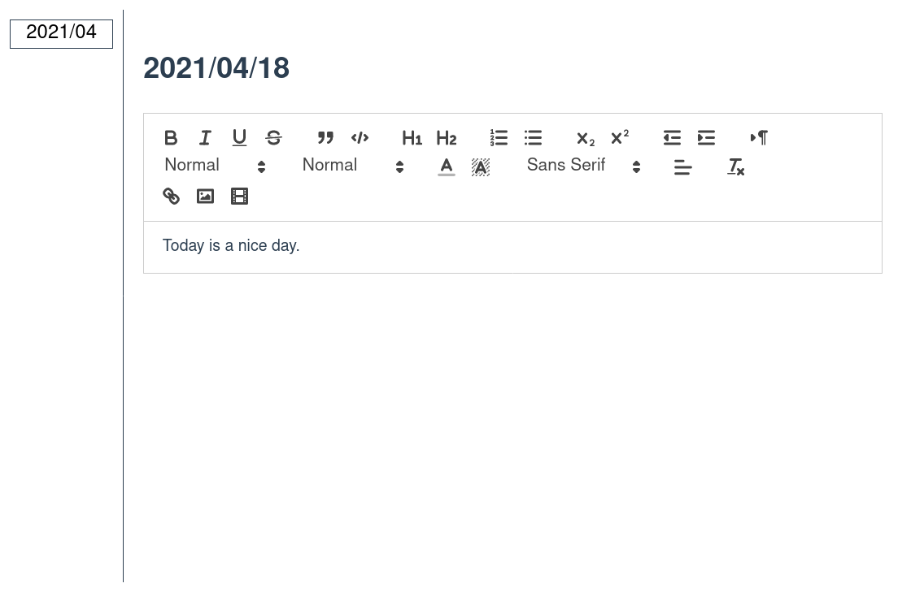

# niki - A personal diary system.

*niki* is a diary system:

[](screenshot.png)

## How to deploy

Please use docker-compose.

```sh
git clone https://github.com/ledyba/niki.git
cd niki
cp docker-compose.example.yml docker-compose.yml
# edit docker-compose.yml as you like.
docker-compose build
docker-compose up -d
```

then open `http://<your-host>:8888`.

## Security

In default, everyone can access your diary via Internet.

To protect, please change these line from `docker-compose.yml`:
```yaml
  web:
    ...
    ports:
      - '127.0.0.1:8888:8888' # niki is accessible only from localhost.
```

Then, make a reverse proxy to `niki` with some authentication.

For example, if you are using nginx:

```
server {
  listen      443 ssl http2;
  listen [::]:443 ssl http2;
  server_name  niki.example.com; # put your host

  ssl_certificate ...;
  ssl_certificate_key ...;

  # protect your diary using basic auth.
  # for more details, see
  # https://docs.nginx.com/nginx/admin-guide/security-controls/configuring-http-basic-authentication/
  auth_basic "Basic Authentication";
  auth_basic_user_file /etc/nginx/conf.d/.htpasswd;

  # protect your diary using SSL client cert.
  # for more details, see
  # https://pages.karamandi.com/2017/08/01/client-certificate-hass-nginx.html
  ssl_verify_client on;
  ssl_client_certificate /etc/nginx/your-ca.crt;

  client_max_body_size 512m;
  location / {
    expires off;
    proxy_set_header Host $host;
    proxy_set_header X-Real-IP $remote_addr;
    proxy_set_header X-Forwarded-Proto https;
    proxy_set_header X-Forwarded-Host $host;
    proxy_set_header X-Forwarded-For $proxy_add_x_forwarded_for;
    proxy_redirect http:// https://;
    proxy_pass http://127.0.0.1:8888/;
  }
}

```
